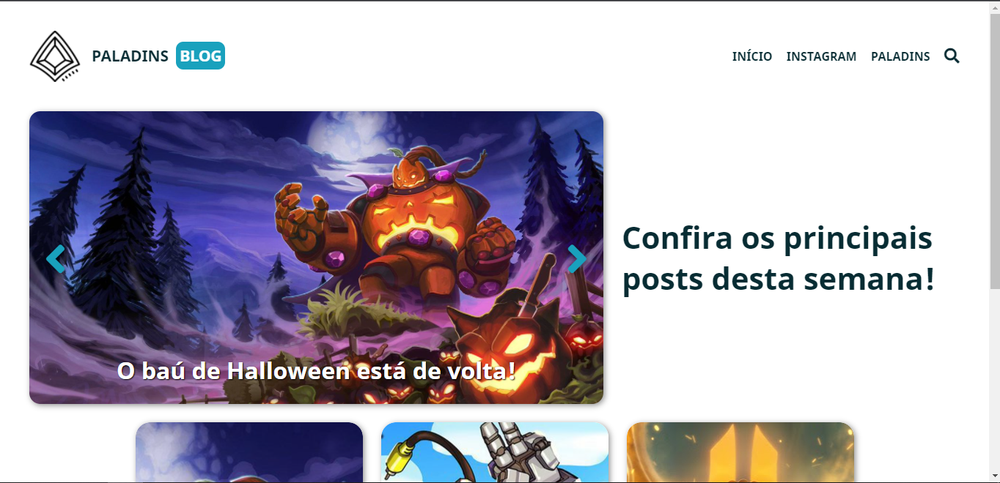
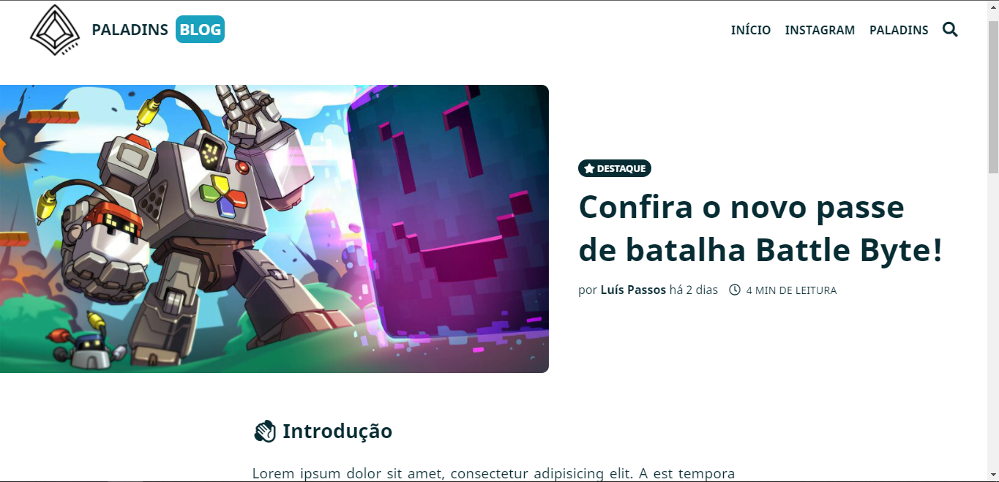
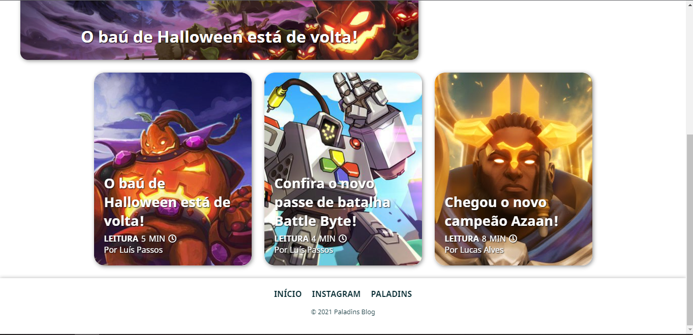

  

:page_facing_up: A simple blog about Paladins and Node JS 💎

<h1 align="center">Paladins Blog</h1>

## Project Status :construction:
- Paladins Blog | Project complete :white_check_mark:

## Demonstration

## Technologies used :scroll:
- <a href="https://developer.mozilla.org/pt-BR/docs/Web/HTML">HTML</a>
- <a href="https://developer.mozilla.org/pt-BR/docs/Web/CSS">CSS</a>
- <a href="https://developer.mozilla.org/pt-BR/docs/Web/JavaScript">JS</a>
- <a href="https://nodejs.org/en/">Node JS</a>
- <a href="https://firebase.google.com/?hl=pt">Firebase</a>

## License :white_check_mark:

- MIT License, <a href="./LICENSE">read more<a/>.

luisspassos &copy; 2021.

